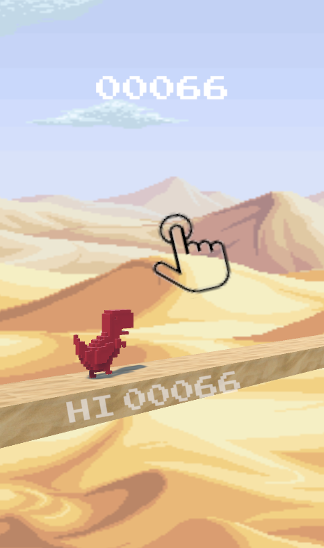
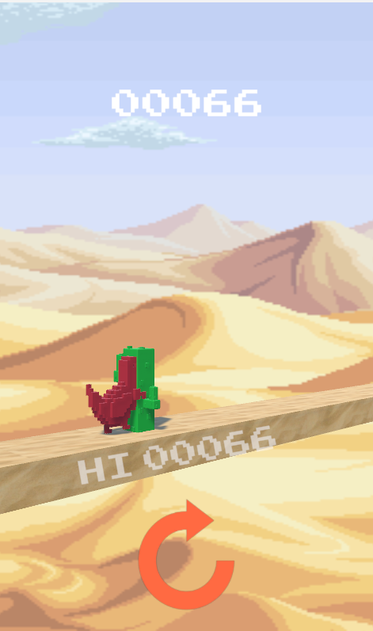

<h1 align="center">🦖 DinoRun 3D 🎮</h1>

  Welcome to <strong>DinoRun 3D</strong>, an exciting endless runner inspired by the infamous Chrome dino game.

<h2 align="center">🎥 Game Screenshots</h2>

  
  

<h2 align="center">🚀 Features</h2>

  ✅ <strong>Fast-paced endless running action</strong> 
  ✅ <strong>Obstacles that keep you on your toes</strong> 
  ✅ <strong>Dynamic spawning system for endless fun</strong> 
  ✅ <strong>Simple, fun, and addictive gameplay</strong> 
  ✅ <strong>Colorful 3D graphics</strong> 🎨

<h2 align="center">🎮 Controls</h2>

  🕹️ <strong>Jump:</strong> <code>Spacebar</code> or <code>MB1</code>

<h2 align="center">🛠️ How the Game Works (Under the Hood)</h2>

  DinoRun 3D follows a structured game logic powered by Unity scripts.

<h3 align="center">1️⃣ GameManager.cs (Core Game Logic)</h3>

  - Handles <strong>game state</strong> (start, restart, and game over). 
  - Controls <strong>game speed</strong>, increasing difficulty over time. 
  - Updates <strong>score</strong> and <strong>high score</strong>. 
  - Manages <strong>UI elements</strong> (buttons, score display, animations).

<h3 align="center">2️⃣ PlayerController.cs (Dino Movement)</h3>

  - Detects <strong>player inputs</strong> to jump. 
  - Ensures <strong>ground detection</strong> to prevent mid-air jumps. 
  - <strong>Plays sound effects</strong> for jumping and collisions. 
  - Stops the game if the player <strong>hits an obstacle</strong>.

<h3 align="center">3️⃣ Spawner.cs (Obstacle Generation)</h3>

  - Spawns <strong>random obstacles</strong> at different intervals. 
  - Uses a <strong>weighted probability system</strong> to control spawn rates. 
  - Continuously generates obstacles unless the game is over.

<h3 align="center">4️⃣ Obstacle.cs (Obstacle Behavior)</h3>

  - Moves obstacles toward the player at the <strong>current game speed</strong>. 
  - <strong>Destroys obstacles</strong> once they leave the screen to optimize performance.

<h2 align="center">📥 Installation Instructions</h2>

<h3 align="center">Option 1️⃣: Clone the Entire Repository (Recommended)</h3>

  <code>git clone https://github.com/S1MS4/DinoRun-3d.git</code>

  This will download both the <strong>Game</strong> and <strong>Game Files</strong> folders.

  Open the project in <strong>Unity</strong> and/or start playing immediately from the <strong>Game</strong> folder alone! 🎮

<h3 align="center">Option 2️⃣: Download Game & Game Files Separately</h3>

  1️⃣ <strong>Download the Game Folder</strong> 
  - Click on the <strong>Game</strong> folder → Click Download  

  2️⃣ <strong>Download the Game Files Folder</strong> 
  - Click on the <strong>Game Files</strong> folder → Click Download  

  3️⃣ <strong>Move the Game Files folder into your Unity project directory</strong> 
  - Open the project in <strong>Unity</strong> and start playing! 🦖

<h3 align="center">🔧 How to Start Playing</h3>

  1️⃣ Open the project in <strong>Unity</strong> or open the .exe in the <strong>Game</strong> folder 🎮 
  2️⃣ Click the screen or hit <code>spacebar</code> to start running! 🦖💨

<h2 align="center">🤝 Contributing</h2>

  Want to help make <strong>DinoRun 3D</strong> even better? Feel free to fork, submit issues, or create pull requests! 🛠️

<h2 align="center">📜 License</h2>

  This project is <strong>open-source</strong>! Feel free to modify and share. 😊

<h3 align="center">🌟 Don't forget to ⭐ the repo if you found this helpful! 💨</h3>
